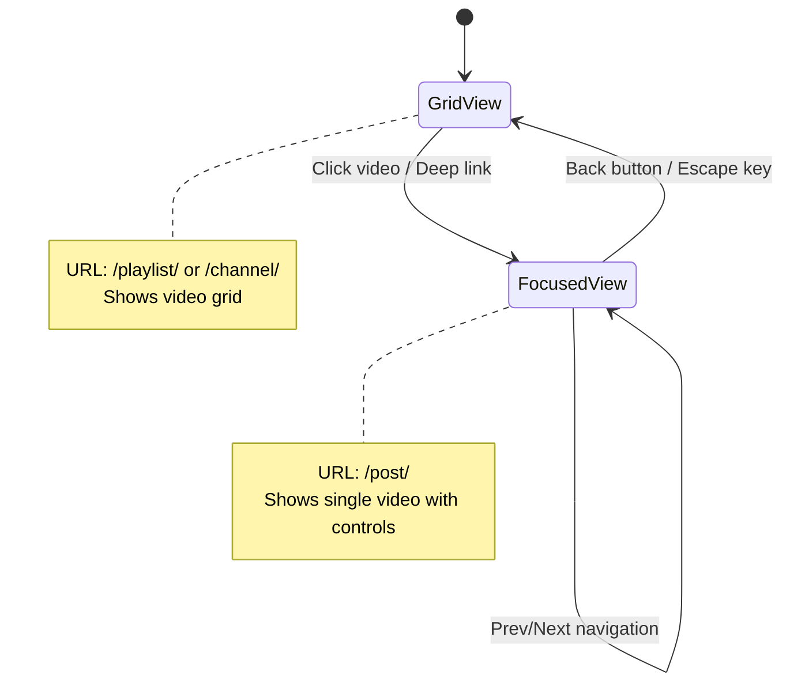
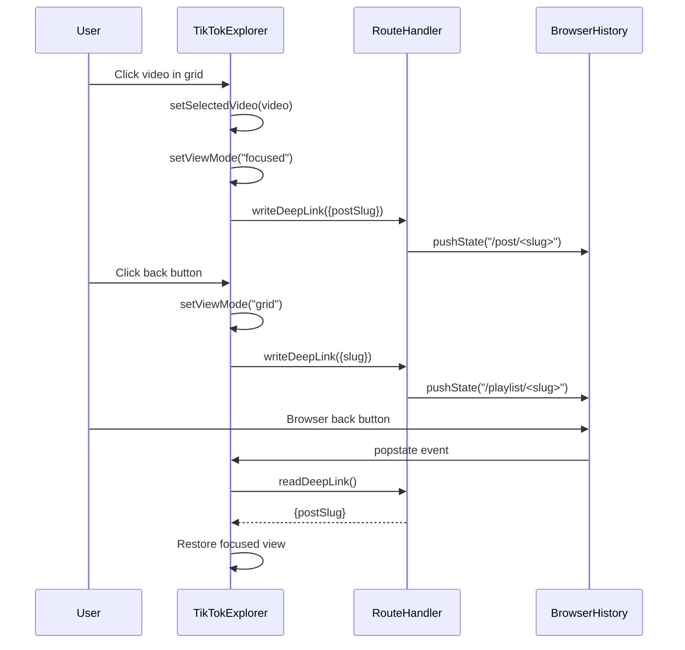

# Design Document: TikTok Post Page Improvements

## Overview

This design addresses two critical user experience issues in the TikTok Explorer: (1) the lack of intuitive navigation controls in the focused post view, and (2) inconsistent browser history management that breaks the back button and URL sharing functionality.

The solution introduces a comprehensive navigation system with visual controls, keyboard shortcuts, and proper URL routing that maintains browser history integrity. The design ensures users can seamlessly navigate between videos, share deep links to specific posts, and use browser navigation naturally.

### Key Design Goals

- Provide intuitive navigation controls (back button, prev/next arrows) in focused view
- Implement proper browser history management with pushState/popstate
- Establish consistent URL slug structure for saved resources (path-based) vs unsaved (query params)
- Support keyboard navigation (arrow keys, escape) for power users
- Maintain view state restoration across page refreshes and browser navigation
- Deliver clear error messages for invalid or missing resources

## Architecture

### Component Structure

The implementation centers on three main modules:

1. **TikTokExplorer Component** (`src/components/TikTokExplorer.tsx`)
   - Manages view state (grid vs focused)
   - Handles video selection and navigation
   - Coordinates with route handler for URL updates
   - Implements keyboard event listeners

2. **Route Handler** (`src/utils/tiktokRoute.ts`)
   - Reads and writes URL state (readDeepLink / writeDeepLink)
   - Distinguishes between saved (path-based) and unsaved (query param) resources
   - Manages browser history with pushState/replaceState

3. **Saved Playlists Manager** (`src/utils/savedTikTokPlaylists.ts`)
   - Persists playlists to localStorage
   - Generates unique slugs for resources
   - Resolves slugs to saved data

### State Flow



### Navigation Flow



## Components and Interfaces

### TikTokExplorer Enhancements

#### New State Variables

```typescript
// Track current video index for prev/next navigation
const [selectedVideoIndex, setSelectedVideoIndex] = useState<number>(-1);
```

#### New Navigation Functions

```typescript
/**
 * Navigate to the previous video in the playlist
 * Updates selectedVideo, selectedVideoIndex, and URL
 */
const navigateToPrevious = useCallback(() => {
  if (!playlist || selectedVideoIndex <= 0) return;
  const prevVideo = playlist.videos[selectedVideoIndex - 1];
  setSelectedVideo(prevVideo);
  setSelectedVideoIndex(selectedVideoIndex - 1);
  writeDeepLink({ view: "tiktok", postSlug: slugifySavedPost(prevVideo) });
}, [playlist, selectedVideoIndex]);

/**
 * Navigate to the next video in the playlist
 * Updates selectedVideo, selectedVideoIndex, and URL
 */
const navigateToNext = useCallback(() => {
  if (!playlist || selectedVideoIndex >= playlist.videos.length - 1) return;
  const nextVideo = playlist.videos[selectedVideoIndex + 1];
  setSelectedVideo(nextVideo);
  setSelectedVideoIndex(selectedVideoIndex + 1);
  writeDeepLink({ view: "tiktok", postSlug: slugifySavedPost(nextVideo) });
}, [playlist, selectedVideoIndex]);

/**
 * Return to grid view from focused view
 * Updates viewMode and URL to playlist/channel slug
 */
const returnToGrid = useCallback(() => {
  setViewMode("grid");
  setSelectedVideo(null);
  setSelectedVideoIndex(-1);
  const slug = routeSlugForList(listTab, analyzedUrl, playlist?.title);
  writeDeepLink({ view: "tiktok", tab: listTab, slug });
}, [listTab, analyzedUrl, playlist, routeSlugForList]);
```

#### Keyboard Event Handler

```typescript
/**
 * Handle keyboard navigation in focused view
 * - Left arrow: previous video
 * - Right arrow: next video
 * - Escape: return to grid
 */
useEffect(() => {
  if (viewMode !== "focused") return;
  
  const handleKeyDown = (e: KeyboardEvent) => {
    switch (e.key) {
      case "ArrowLeft":
        e.preventDefault();
        navigateToPrevious();
        break;
      case "ArrowRight":
        e.preventDefault();
        navigateToNext();
        break;
      case "Escape":
        e.preventDefault();
        returnToGrid();
        break;
    }
  };
  
  window.addEventListener("keydown", handleKeyDown);
  return () => window.removeEventListener("keydown", handleKeyDown);
}, [viewMode, navigateToPrevious, navigateToNext, returnToGrid]);
```

#### Focused View UI Components

```typescript
/**
 * Navigation controls for focused view
 * Displays back button and prev/next arrows
 */
function FocusedViewNavigation({
  onBack,
  onPrevious,
  onNext,
  hasPrevious,
  hasNext,
  showPrevNext,
}: {
  onBack: () => void;
  onPrevious: () => void;
  onNext: () => void;
  hasPrevious: boolean;
  hasNext: boolean;
  showPrevNext: boolean;
}) {
  return (
    <div className="flex items-center justify-between mb-6">
      <button
        type="button"
        onClick={onBack}
        className="flex items-center gap-2 px-4 py-2 rounded-lg bg-white border border-[#1A1A1A]/10 hover:bg-[#F9F8F6] transition-colors"
      >
        <ArrowLeft className="h-4 w-4" />
        <span className="font-mono text-xs uppercase tracking-wider">Back to Grid</span>
      </button>
      
      {showPrevNext && (
        <div className="flex items-center gap-2">
          <button
            type="button"
            onClick={onPrevious}
            disabled={!hasPrevious}
            className="p-2 rounded-lg bg-white border border-[#1A1A1A]/10 hover:bg-[#F9F8F6] disabled:opacity-30 disabled:cursor-not-allowed transition-colors"
            title="Previous video (Left arrow)"
          >
            <ChevronLeft className="h-5 w-5" />
          </button>
          <button
            type="button"
            onClick={onNext}
            disabled={!hasNext}
            className="p-2 rounded-lg bg-white border border-[#1A1A1A]/10 hover:bg-[#F9F8F6] disabled:opacity-30 disabled:cursor-not-allowed transition-colors"
            title="Next video (Right arrow)"
          >
            <ChevronRight className="h-5 w-5" />
          </button>
        </div>
      )}
    </div>
  );
}
```

### Route Handler Updates

#### Enhanced writeDeepLink Function

```typescript
/**
 * Write URL state to browser history
 * - Saved resources use path-based routes: /playlist/<slug>, /channel/<slug>, /post/<slug>
 * - Unsaved resources use query params: ?view=tiktok&tab=<type>&url=<encoded>
 * - Skips update if URL hasn't changed (prevents duplicate history entries)
 * - Uses pushState by default, replaceState when replace=true
 */
export function writeDeepLink(link: TikTokDeepLink, replace = false): void {
  if (typeof window === "undefined") return;
  
  let href: string;
  
  // Saved post: /post/<slug>
  if (link.postSlug) {
    href = `/post/${encodeURIComponent(link.postSlug)}`;
  }
  // Saved playlist/channel: /playlist/<slug> or /channel/<slug>
  else if (link.slug && link.tab) {
    const prefix = link.tab === "channel" ? "channel" : "playlist";
    href = `/${prefix}/${encodeURIComponent(link.slug)}`;
  }
  // Unsaved resource: ?view=tiktok&tab=<type>&url=<encoded>
  else {
    const params = new URLSearchParams();
    params.set("view", link.view);
    if (link.tab) params.set("tab", link.tab);
    if (link.url) params.set("url", link.url);
    const qs = params.toString();
    href = `${window.location.pathname}${qs ? `?${qs}` : ""}`;
  }
  
  // Skip if URL hasn't changed
  const current = `${window.location.pathname}${window.location.search}`;
  if (href === current) return;
  
  // Update browser history
  if (replace) {
    window.history.replaceState(null, "", href);
  } else {
    window.history.pushState(null, "", href);
  }
}
```

#### Enhanced readDeepLink Function

```typescript
/**
 * Read URL state from current location
 * - Path-based routes: /playlist/<slug>, /channel/<slug>, /post/<slug>
 * - Query param routes: ?view=tiktok&tab=<type>&url=<encoded>
 * Returns normalized TikTokDeepLink object
 */
export function readDeepLink(): TikTokDeepLink {
  if (typeof window === "undefined") return { view: "movie" };
  
  const pathParts = window.location.pathname.split("/").filter(Boolean);
  
  // /post/<slug>
  if (pathParts[0] === "post" && pathParts[1]) {
    return {
      view: "tiktok",
      postSlug: decodeURIComponent(pathParts[1]),
    };
  }
  
  // /playlist/<slug>
  if (pathParts[0] === "playlist" && pathParts[1]) {
    return {
      view: "tiktok",
      tab: "collection",
      slug: decodeURIComponent(pathParts[1]),
    };
  }
  
  // /channel/<slug>
  if (pathParts[0] === "channel" && pathParts[1]) {
    return {
      view: "tiktok",
      tab: "channel",
      slug: decodeURIComponent(pathParts[1]),
    };
  }
  
  // Query param format
  const params = new URLSearchParams(window.location.search);
  const rawView = params.get("view");
  const view: MainView = isMainView(rawView) ? rawView : "movie";
  const rawTab = params.get("tab");
  const tab: ListTab | undefined = isListTab(rawTab) ? rawTab : undefined;
  const url = (params.get("url") || "").trim() || undefined;
  
  return { view, tab, url };
}
```

### Saved Playlists Manager Updates

#### Slug Collision Handling

```typescript
/**
 * Generate unique slug for a playlist title
 * If collision detected, append timestamp suffix
 */
export function slugifySavedPlaylistTitle(title: string, existingSlugs?: Set<string>): string {
  const baseSlug = (title || "playlist")
    .toLowerCase()
    .replace(/['"]/g, "")
    .replace(/[^a-z0-9]+/g, "-")
    .replace(/^-+|-+$/g, "")
    .slice(0, 70);
  
  const slug = baseSlug || "playlist";
  
  // Check for collision if existingSlugs provided
  if (existingSlugs && existingSlugs.has(slug)) {
    return `${slug}-${Date.now()}`;
  }
  
  return slug;
}

/**
 * Get all existing slugs for collision detection
 */
export function getAllExistingSlugs(): Set<string> {
  const summaries = listSavedPlaylistSummaries();
  return new Set(summaries.map(s => s.slug));
}
```

## Data Models

### TikTokDeepLink Interface

```typescript
export interface TikTokDeepLink {
  view: MainView;              // "movie" | "tiktok" | "rewriter"
  tab?: ListTab;               // "collection" | "channel"
  url?: string;                // Raw TikTok URL (for unsaved resources)
  slug?: string;               // Playlist/channel slug (for saved resources)
  postSlug?: string;           // Individual post slug (for focused view)
}
```

### Navigation State

```typescript
interface NavigationState {
  viewMode: "grid" | "focused";
  selectedVideo: TikTokVideo | null;
  selectedVideoIndex: number;
  listTab: ListTab;
  playlist: TikTokPlaylist | null;
  analyzedUrl: string;
}
```

### URL Patterns

| Resource Type | Saved | URL Pattern | Example |
|--------------|-------|-------------|---------|
| Playlist | Yes | `/playlist/<slug>` | `/playlist/funny-cats-compilation` |
| Channel | Yes | `/channel/<slug>` | `/channel/charlidamelio` |
| Post | Yes | `/post/<slug>` | `/post/charlidamelio-dance-video-123` |
| Playlist | No | `?view=tiktok&tab=collection&url=<encoded>` | `?view=tiktok&tab=collection&url=https%3A%2F%2F...` |
| Channel | No | `?view=tiktok&tab=channel&url=<encoded>` | `?view=tiktok&tab=channel&url=https%3A%2F%2F...` |

## Correctness Properties

*A property is a characteristic or behavior that should hold true across all valid executions of a system—essentially, a formal statement about what the system should do. Properties serve as the bridge between human-readable specifications and machine-verifiable correctness guarantees.*

### Property 1: Navigation updates URL consistently

*For any* navigation action (clicking prev/next buttons, keyboard arrows, or back to grid), the URL should be updated to accurately reflect the new state, and a new browser history entry should be created.

**Validates: Requirements 1.3, 1.4, 2.1, 2.2, 2.5, 6.6**

### Property 2: Browser history restoration preserves view state

*For any* browser history navigation (back or forward button), the system should restore the exact view mode (grid or focused), selected video, and playlist that was active when that history entry was created.

**Validates: Requirements 2.3, 2.4, 2.6, 4.3**

### Property 3: URL format matches resource type

*For any* resource being displayed, if it's saved in localStorage, the URL should use path-based format (`/playlist/<slug>`, `/channel/<slug>`, or `/post/<slug>`), and if it's unsaved, the URL should use query parameter format (`?view=tiktok&tab=<type>&url=<encoded>`).

**Validates: Requirements 3.1, 3.2, 3.3, 3.4, 3.5**

### Property 4: Slugs are unique within resource type

*For any* set of saved resources of the same type (playlists, channels, or posts), no two resources should have identical slugs. If a collision would occur, the system should append a unique identifier.

**Validates: Requirements 3.6, 3.7**

### Property 5: View mode matches URL pattern

*For any* URL being loaded, if it's a post URL (`/post/<slug>`), the system should display focused view, and if it's a playlist or channel URL, the system should display grid view.

**Validates: Requirements 4.1, 4.2, 4.6**

### Property 6: Navigation state consistency

*For any* navigation state, the URL, viewMode, selectedVideo, and selectedVideoIndex should all be consistent with each other—if viewMode is "focused", selectedVideo should be non-null and the URL should be a post URL; if viewMode is "grid", selectedVideo should be null and the URL should be a playlist or channel URL.

**Validates: Requirements 2.7**

### Property 7: Prev/next button state correctness

*For any* focused view state with a playlist, the previous button should be disabled when selectedVideoIndex is 0, and the next button should be disabled when selectedVideoIndex is playlist.length - 1.

**Validates: Requirements 1.5, 1.6**

### Property 8: Prev/next navigation bounds

*For any* video in a playlist that is not the first video, clicking previous (or pressing left arrow) should navigate to the video at index - 1. For any video that is not the last video, clicking next (or pressing right arrow) should navigate to the video at index + 1.

**Validates: Requirements 1.3, 1.4, 6.2, 6.3**

### Property 9: Keyboard navigation equivalence

*For any* navigation action available via UI buttons (previous, next, back to grid), the same action should be achievable via keyboard shortcuts (left arrow, right arrow, escape), and both methods should produce identical state changes and URL updates.

**Validates: Requirements 6.1, 6.2, 6.3, 6.4**

### Property 10: Keyboard event prevention

*For any* keyboard navigation event (arrow keys, escape) in focused view, the default browser behavior should be prevented to avoid conflicts with page scrolling or other browser shortcuts.

**Validates: Requirements 6.5**

### Property 11: Saved resource loading

*For any* valid saved resource slug, loading that slug should restore the correct playlist data from localStorage and display it in the appropriate view mode.

**Validates: Requirements 4.4**

### Property 12: URL slug validation

*For any* URL slug being processed, the system should validate its format before attempting to load resources, rejecting malformed slugs early.

**Validates: Requirements 7.4**

### Property 13: Error logging without exposure

*For any* navigation error that occurs, the system should log technical details to the console for debugging, but display only user-friendly messages in the UI without exposing implementation details.

**Validates: Requirements 7.6**

### Property 14: Interactive element feedback

*For any* interactive element (buttons, links) in the focused view, hovering or focusing should apply visual feedback classes to indicate interactivity.

**Validates: Requirements 5.4**

### Property 15: Loading state visibility

*For any* analysis operation in progress, the analyze button should display a loading indicator and be disabled to prevent duplicate requests.

**Validates: Requirements 5.5**

### Property 16: Responsive layout integrity

*For any* viewport size (mobile, tablet, desktop), the focused view layout should maintain proper structure without horizontal scrolling or overlapping elements.

**Validates: Requirements 5.6**

### Property 17: Prev/next controls visibility

*For any* focused view state, if the playlist contains more than one video, the prev/next navigation controls should be visible; if the playlist contains only one video, they should be hidden.

**Validates: Requirements 1.2**

## Error Handling

### Missing Saved Resources

When a user navigates to a saved resource URL (playlist, channel, or post slug) that doesn't exist in localStorage:

```typescript
// In TikTokExplorer
const loadSavedPost = useCallback((postSlug: string): boolean => {
  const found = getSavedPostBySlug(postSlug);
  if (!found) {
    setError(
      "This post link is not found in your browser. " +
      "Please open the saved playlist first, or reprocess the original TikTok URL."
    );
    setViewMode("grid");
    return false;
  }
  // ... load the post
  return true;
}, []);
```

**Error Message Components:**
- Clear statement of what went wrong ("post link not found")
- Context about why ("not in your browser")
- Actionable recovery steps ("open the saved playlist" or "reprocess the URL")
- Graceful fallback (return to grid view)

### Invalid URL Slugs

When a malformed slug is detected:

```typescript
function validateSlug(slug: string): boolean {
  // Slugs should be lowercase alphanumeric with hyphens
  const validPattern = /^[a-z0-9-]+$/;
  return validPattern.test(slug) && slug.length > 0 && slug.length <= 100;
}

// In route loading logic
const slug = pathParts[1];
if (!validateSlug(slug)) {
  setError("Invalid link format. Returning to home view.");
  writeDeepLink({ view: "tiktok" }, true); // replace, don't push
  return;
}
```

### Network Errors During Reprocessing

When reprocessing a saved playlist fails:

```typescript
try {
  const data = await fetchTikTokPlaylist(apiUrl, videoCount);
  // ... update saved data
} catch (err) {
  setError(
    err instanceof Error 
      ? `Could not refresh playlist: ${err.message}` 
      : "Failed to refresh playlist. Please try again later."
  );
  console.error("Playlist reprocess error:", err);
}
```

### Browser History Edge Cases

When popstate event fires but URL state is invalid:

```typescript
useEffect(() => {
  const onPop = () => {
    const link = readDeepLink();
    
    // Validate the link before processing
    if (link.view !== "tiktok") return;
    
    if (link.postSlug) {
      const success = loadSavedPost(link.postSlug);
      if (!success) {
        // Error already set by loadSavedPost
        return;
      }
    } else if (link.slug) {
      const rec = getSavedPlaylistBySlug(link.slug);
      if (!rec) {
        setError("Playlist not found. It may have been deleted.");
        writeDeepLink({ view: "tiktok" }, true);
        return;
      }
      // ... load playlist
    }
  };
  
  window.addEventListener("popstate", onPop);
  return () => window.removeEventListener("popstate", onPop);
}, [loadSavedPost]);
```

### Error Recovery UI

All error states should include:
1. Clear error message displayed prominently
2. Dismiss button to clear the error
3. Recovery action (e.g., "Return to Home" button)
4. Automatic error clearing after timeout for transient errors

```typescript
{error && (
  <div className="rounded-2xl border border-red-200 bg-red-50 p-6">
    <div className="flex items-start justify-between">
      <div className="flex items-start gap-3">
        <AlertCircle className="h-5 w-5 text-red-600 mt-0.5" />
        <div>
          <p className="font-mono text-xs font-bold uppercase tracking-wider text-red-900">
            Error
          </p>
          <p className="mt-1 text-sm text-red-800">{error}</p>
        </div>
      </div>
      <button
        type="button"
        onClick={() => setError(null)}
        className="text-red-400 hover:text-red-600"
      >
        <X className="h-5 w-5" />
      </button>
    </div>
    <button
      type="button"
      onClick={() => {
        setError(null);
        writeDeepLink({ view: "tiktok" });
      }}
      className="mt-4 rounded-lg bg-red-600 px-4 py-2 text-sm font-medium text-white hover:bg-red-700"
    >
      Return to Home
    </button>
  </div>
)}
```

## Testing Strategy

### Dual Testing Approach

This feature requires both unit tests and property-based tests to ensure comprehensive coverage:

- **Unit tests** verify specific examples, edge cases, and error conditions
- **Property-based tests** verify universal properties across all inputs
- Together they provide comprehensive coverage: unit tests catch concrete bugs, property tests verify general correctness

### Property-Based Testing

We'll use **fast-check** (JavaScript/TypeScript property-based testing library) to implement the correctness properties defined above.

**Configuration:**
- Minimum 100 iterations per property test
- Each test tagged with feature name and property number
- Tag format: `Feature: tiktok-post-page-improvements, Property {N}: {property text}`

**Example Property Test:**

```typescript
import fc from 'fast-check';
import { describe, it, expect } from 'vitest';

describe('Feature: tiktok-post-page-improvements', () => {
  it('Property 1: Navigation updates URL consistently', () => {
    fc.assert(
      fc.property(
        fc.record({
          videos: fc.array(fc.record({
            id: fc.string(),
            title: fc.string(),
            author: fc.string(),
          }), { minLength: 2, maxLength: 10 }),
          currentIndex: fc.nat(),
        }),
        ({ videos, currentIndex }) => {
          const index = currentIndex % videos.length;
          const video = videos[index];
          
          // Simulate navigation
          const initialUrl = window.location.href;
          navigateToVideo(video);
          const newUrl = window.location.href;
          
          // URL should have changed
          expect(newUrl).not.toBe(initialUrl);
          
          // URL should contain post slug
          expect(newUrl).toContain('/post/');
          
          // History length should increase
          expect(window.history.length).toBeGreaterThan(initialHistoryLength);
        }
      ),
      { numRuns: 100 }
    );
  });
});
```

### Unit Testing Focus Areas

Unit tests should cover:

1. **Specific navigation scenarios**
   - First video → previous button disabled
   - Last video → next button disabled
   - Middle video → both buttons enabled
   - Single video playlist → no prev/next controls

2. **URL format examples**
   - Saved playlist: `/playlist/funny-cats`
   - Saved channel: `/channel/charlidamelio`
   - Saved post: `/post/charlidamelio-dance-123`
   - Unsaved collection: `?view=tiktok&tab=collection&url=...`

3. **Error conditions**
   - Invalid post slug → error message
   - Missing saved resource → error with recovery
   - Malformed URL → redirect to home

4. **Keyboard shortcuts**
   - Left arrow → previous video
   - Right arrow → next video
   - Escape → back to grid
   - preventDefault called on all navigation keys

5. **Browser history integration**
   - Back button from focused → grid view
   - Forward button → restore focused view
   - Refresh on post URL → restore focused view

### Integration Testing

Test the complete user flows:

1. **Grid to focused to grid flow**
   - Start in grid view
   - Click video → focused view
   - Click back → grid view
   - Verify URL updates at each step
   - Verify browser back button works

2. **Sequential video navigation**
   - Open first video
   - Click next repeatedly
   - Verify each video loads
   - Verify URL updates
   - Click browser back repeatedly
   - Verify each previous video restores

3. **Deep link loading**
   - Navigate to `/post/<slug>` directly
   - Verify focused view loads
   - Verify correct video selected
   - Verify playlist context loaded

4. **Keyboard navigation flow**
   - Open video in focused view
   - Use arrow keys to navigate
   - Use escape to return to grid
   - Verify equivalent to button clicks

### Test Data Generators

For property-based tests, we need generators for:

```typescript
// Generate random TikTok video
const videoArb = fc.record({
  id: fc.string({ minLength: 1 }),
  title: fc.string({ minLength: 1, maxLength: 100 }),
  author: fc.string({ minLength: 1 }),
  authorHandle: fc.string({ minLength: 1 }),
  playUrl: fc.webUrl(),
  dynamicCover: fc.webUrl(),
  stats: fc.record({
    diggCount: fc.nat(),
    commentCount: fc.nat(),
    shareCount: fc.nat(),
    playCount: fc.nat(),
  }),
});

// Generate random playlist
const playlistArb = fc.record({
  title: fc.string({ minLength: 1, maxLength: 100 }),
  videos: fc.array(videoArb, { minLength: 1, maxLength: 20 }),
});

// Generate random navigation state
const navStateArb = fc.record({
  viewMode: fc.constantFrom('grid', 'focused'),
  selectedIndex: fc.nat(),
  listTab: fc.constantFrom('collection', 'channel'),
});
```

### Coverage Goals

- Line coverage: >90%
- Branch coverage: >85%
- Property test coverage: All 17 properties implemented
- Unit test coverage: All edge cases and error conditions
- Integration test coverage: All major user flows

### Continuous Testing

- Run unit tests on every commit
- Run property tests on every PR
- Run integration tests before merge
- Monitor test execution time (property tests may be slower)
- Fail build on any test failure
